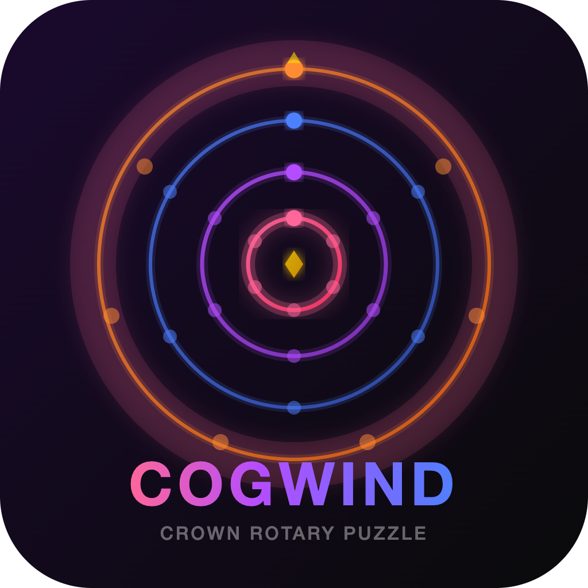
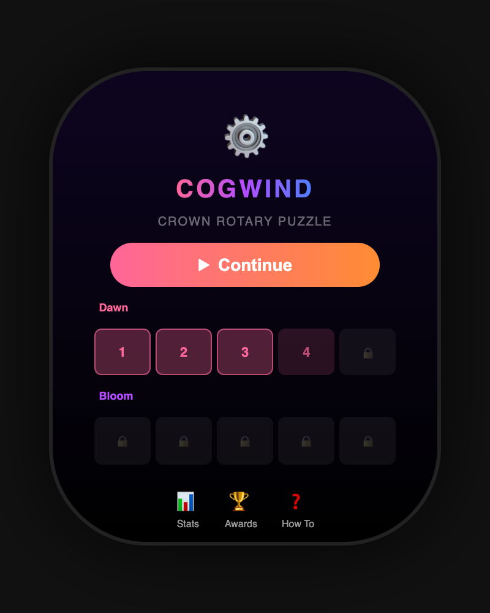
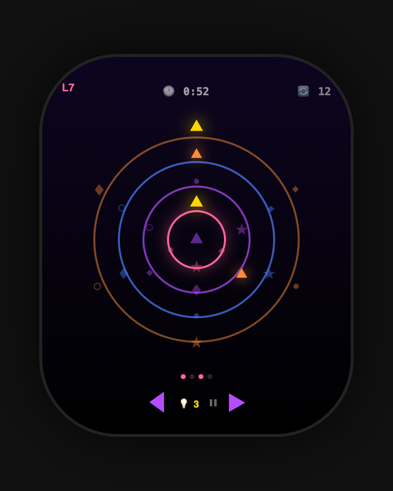
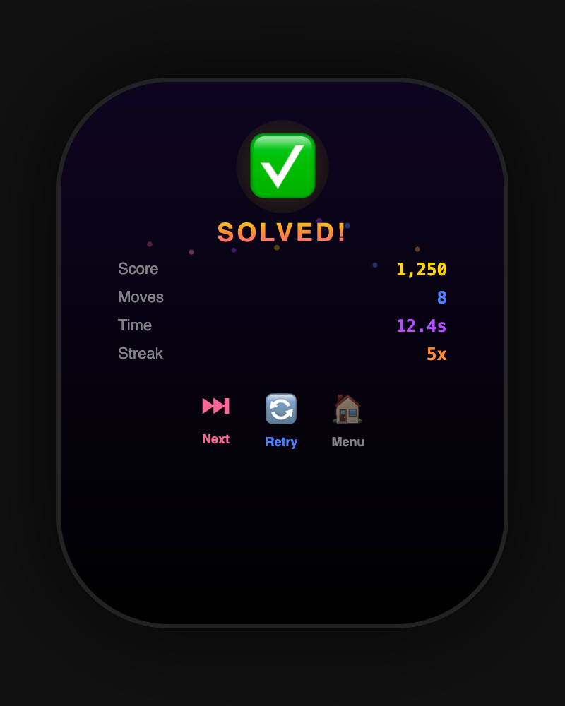
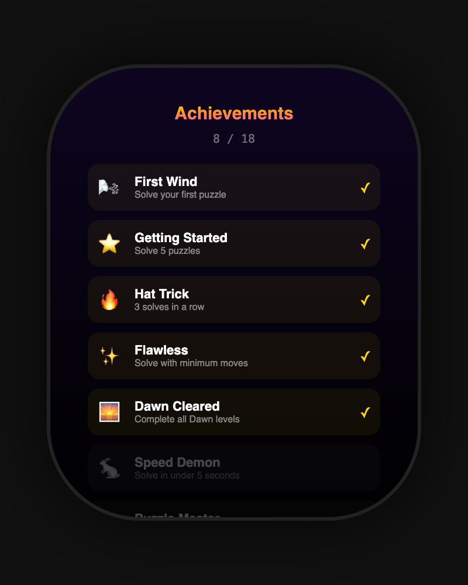

<p align="center">
  
</p>

<h1 align="center">🌀 Cogwind — Crown Rotary Puzzle 🌀</h1>

<p align="center">
  <em>The most uniquely Apple Watch game ever made</em>
</p>

<p align="center">
  
  
  
  
</p>

<p align="center">
  Rotate concentric rings with the <strong>Digital Crown</strong> to align glyphs 🎯<br/>
  Feel every notch through <strong>haptic feedback</strong> 📳<br/>
  Climb through <strong>30 levels</strong> across <strong>6 stunning worlds</strong> 🌍
</p>

---

## 📸 Screenshots

<p align="center">
  
  &nbsp;&nbsp;
  
  &nbsp;&nbsp;
  
  &nbsp;&nbsp;
  
</p>

<p align="center">
  <sub>🏠 Main Menu &nbsp;&nbsp;&nbsp; 🎮 Gameplay &nbsp;&nbsp;&nbsp; 🎉 Victory &nbsp;&nbsp;&nbsp; 🏆 Achievements</sub>
</p>

---

## 🎮 What is Cogwind?

Cogwind turns the Apple Watch's **Digital Crown** — its most unique hardware feature — into the entire game controller. You rotate concentric rings to align glyphs at the 12 o'clock position, with satisfying **haptic detents** on every notch.

It's the kind of game that feels like it was **born** for the Apple Watch. 🎯⌚

---

## ✨ Features at a Glance

| 🎯 | **Feature** | **Details** |
|---|---|---|
| 👑 | **Digital Crown Control** | Turn the crown to rotate rings — the watch's signature input IS the game |
| 📳 | **Haptic Feedback** | 7 distinct haptic patterns: notch clicks, ring snaps, victory celebrations, time warnings |
| 🌍 | **6 Worlds** | Dawn 🌅, Bloom 🌸, Storm ⛈️, Ember 🔥, Cosmos 🌌, Abyss 🌊 |
| 📊 | **30 Handcrafted Levels** | From 2-ring warmups to 8-ring brain-melters |
| ♾️ | **Infinite Mode** | Procedurally generated levels that never end |
| 💡 | **Smart Hint System** | 3 free hints + earn 1 per solve — shows direction & target ring |
| 🏆 | **18 Achievements** | From "First Wind" to "Puzzle Master" — unlock 'em all! |
| 📈 | **Detailed Scoring** | Time bonus + move efficiency + level multiplier + streak combo |
| 📊 | **Stats Dashboard** | High scores, best times, streaks, play time, achievement progress |
| 🎓 | **Interactive Tutorial** | 5-step onboarding — learn the ropes in 30 seconds |
| 🎨 | **Gorgeous Aesthetics** | Pink 💗 Purple 💜 Blue 💙 Orange 🧡 color palette |
| ⚡ | **Pure SwiftUI** | No UIKit, no storyboards — 100% modern Apple tech |

---

## 🌍 The Six Worlds

Each world brings new challenges with more rings, more segments, and tighter time limits! 🔥

| World | Levels | Rings | Vibe | Description |
|-------|--------|-------|------|-------------|
| 🌅 **Dawn** | 1–5 | 2 | Peaceful | Gentle introduction, no time pressure on early levels |
| 🌸 **Bloom** | 6–10 | 3 | Growing | Three rings bloom into play, moderate time limits |
| ⛈️ **Storm** | 11–15 | 4 | Intense | Four rings with tighter windows — stay sharp! |
| 🔥 **Ember** | 16–20 | 5 | Blazing | Five rings, the heat is seriously on |
| 🌌 **Cosmos** | 21–25 | 5–6 | Epic | Up to six rings with 10 segments each |
| 🌊 **Abyss** | 26–30 | 6–8 | Ultimate | Seven to eight rings — only legends survive |

> 💫 **Beat all 30?** Infinite Mode generates endless levels that keep scaling forever!

---

## 👑 Digital Crown — The Whole Game

This isn't a tacked-on feature. The Digital Crown **IS** the game:

- 🔄 **Rotate** the selected ring by turning the crown
- 📳 **Feel** each notch through haptic detent feedback
- ⬅️➡️ **Switch** rings using the on-screen arrow buttons
- 🎯 **Align** all target glyphs to the 12 o'clock position to win
- ⚡ Every rotation is precise, responsive, and satisfying

---

## 💡 Hint System

Stuck on a puzzle? Don't worry — hints have your back! 🧠

- 🆓 Start with **3 free hints**
- 🔍 Hints highlight the **unsolved ring** and show the **rotation direction**
- ➕ **Earn 1 hint per puzzle solved** — the more you play, the more you get!
- 🔢 Hint counter displayed in the gameplay HUD
- ⏱️ Hints auto-dismiss after 3 seconds — a nudge, not a giveaway

---

## 📈 Scoring & Combos

Every solve earns you points! Compete against yourself for the ultimate high score 🏅

| Component | How It Works |
|-----------|-------------|
| ⏱️ **Time Bonus** | Faster solves = more points (timed levels only) |
| 🎯 **Move Efficiency** | Fewer rotations = higher score |
| 📊 **Level Multiplier** | Harder levels are worth way more |
| 🔥 **Streak Bonus** | Consecutive solves without failing boost your score |
| ⭐ **Per-Level High Scores** | Your best score for every level is tracked |

---

## 🏆 18 Achievements

Unlock badges for milestones as you play! 🎖️

| Badge | Achievement | How to Unlock |
|-------|------------|---------------|
| 🌬️ | **First Wind** | Solve your very first puzzle |
| ⭐ | **Getting Started** | Solve 5 puzzles |
| 🌟 | **Puzzle Adept** | Solve 10 puzzles |
| 👑 | **Puzzle Master** | Solve 50 puzzles |
| 🔥 | **Hat Trick** | 3 solves in a row |
| 🔥 | **On Fire** | 5 solves in a row |
| ⚡ | **Unstoppable** | 10 solves in a row |
| ✨ | **Flawless** | Solve with minimum moves |
| 🐇 | **Speed Demon** | Solve in under 5 seconds |
| 🌅 | **Dawn Cleared** | Complete all Dawn levels |
| 🌸 | **Bloom Cleared** | Complete all Bloom levels |
| ⛈️ | **Storm Cleared** | Complete all Storm levels |
| 🔥 | **Ember Cleared** | Complete all Ember levels |
| 🌌 | **Cosmos Cleared** | Complete all Cosmos levels |
| 🌊 | **Abyss Cleared** | Complete all Abyss levels |
| 💡 | **Hint Collector** | Accumulate 20 hints |
| 🧠 | **No Help Needed** | Clear 10 levels without using hints |
| 🏃 | **Marathoner** | Play for 30 minutes total |

> 🔔 Achievement toasts pop up in-game the moment you unlock one!

---

## 🎨 Aesthetics & Design

Cogwind is designed to be **visually stunning** on the small watch screen ✨

- 💗 **Pink** · 💜 **Purple** · 💙 **Blue** · 🧡 **Orange** — vibrant color palette throughout
- 🌈 Each ring gets its own color, creating a beautiful **glowing mandala**
- ✨ **Gold accents** for aligned glyphs, achievements, and hints
- 🌑 Deep dark gradient backgrounds with subtle purple tones
- 💫 **Spring animations** on every crown rotation
- 🎉 **Confetti particle burst** on puzzle completion
- 🔆 **Glow effects** on target glyphs and solved rings
- 📱 Optimized for every Apple Watch screen size

---

## 🎓 Interactive Tutorial

First time? Cogwind walks you through everything! 📖

1. ⚙️ **Welcome** — What the game is about
2. 👑 **Crown Control** — How to rotate rings
3. ⬅️➡️ **Switch Rings** — How to select different rings
4. 💡 **Hints** — How the hint system works
5. 🚀 **Ready!** — Jump into the action

> 🔄 You can replay the tutorial anytime from the main menu!

---

## 📊 Stats Dashboard

Track everything about your Cogwind journey! 📉📈

- 🏔️ **Highest Level** reached
- ✅ **Total Solves** across all sessions
- 🔥 **Best Streak** — how many in a row
- ✨ **Perfect Solves** — minimum move completions
- ⚡ **Speed Solves** — completed under 5 seconds
- 💡 **Hints Remaining** — your hint bank balance
- ⏱️ **Total Play Time** — lifetime playtime
- 🏆 **Achievement Progress** — X / 18 unlocked
- 📊 **Per-Level High Scores** — best score & time for every level

---

## 🗂️ Project Structure

```
📁 Cogwind Watch App/
├── 🚀 CogwindApp.swift              → App entry point
├── 📁 Models/
│   ├── 🔄 Ring.swift                 → Ring & Segment data models
│   ├── 🌍 Level.swift                → 30 levels + infinite generator
│   └── 💾 GameState.swift            → Stats, achievements, persistence
├── 📁 ViewModels/
│   └── 🧠 GameViewModel.swift        → Game logic, crown input, scoring
├── 📁 Views/
│   ├── 📱 ContentView.swift          → Root view with phase routing
│   ├── 🏠 MenuView.swift             → Main menu with level grid
│   ├── 🎮 GameView.swift             → Gameplay screen with crown input
│   ├── 🌀 RingView.swift             → Concentric ring rendering
│   ├── 🎉 SolvedView.swift           → Victory screen with confetti
│   ├── ⏰ TimeUpView.swift            → Time-out screen
│   ├── 📊 StatsView.swift            → Statistics dashboard
│   ├── 🎓 TutorialView.swift         → 5-step interactive tutorial
│   └── 🏆 AchievementsView.swift     → Achievement gallery
├── 📁 Haptics/
│   └── 📳 HapticEngine.swift         → 7 haptic feedback patterns
├── 📁 Utilities/
│   └── 🎨 Theme.swift                → Pink/purple/blue/orange palette
└── 📁 Assets.xcassets/               → App icon and accent color
```

---

## ⚙️ Requirements

| Requirement | Version |
|---|---|
| 📱 watchOS | 10.0+ |
| 🛠️ Xcode | 15.0+ |
| 🐦 Swift | 5.9+ |
| ⌚ Hardware | Apple Watch Series 4+ (Digital Crown required) |

---

## 🚀 Setup & Installation

### 1️⃣ Clone the repo
```bash
git clone https://github.com/Krishita17/cogwind.git
```

### 2️⃣ Open in Xcode
```bash
cd cogwind
open Cogwind.xcodeproj
```

### 3️⃣ Select target
Choose the **Cogwind Watch App** scheme and pick your Apple Watch simulator or device ⌚

### 4️⃣ Build & Run
Hit `Cmd + R` and start playing! 🎮

> 💡 **Tip:** If running on a physical Apple Watch, set your development team in **Signing & Capabilities**

---

## 🎮 How to Play

1. 🚀 **Launch** the app on your Apple Watch
2. 📖 **Follow the tutorial** on first launch (or tap "How To" anytime)
3. 👑 **Turn the Digital Crown** to rotate the currently selected ring
4. ⬅️➡️ **Tap the arrow buttons** to switch between rings
5. 🎯 **Align all target glyphs** to the top (12 o'clock) to solve!
6. 💡 **Use hints wisely** — tap the lightbulb to reveal the direction
7. ⏱️ **Beat the clock** on timed levels for bonus points
8. 🏆 **Unlock achievements** and climb through all 6 worlds!

---

## 🏗️ Architecture

| Layer | Pattern | Details |
|-------|---------|---------|
| 🧠 **Logic** | MVVM | Clean separation of game state and UI |
| 📱 **UI** | Pure SwiftUI | Declarative views with spring animations |
| 💾 **Persistence** | UserDefaults | Stats, scores, achievements, tutorial state |
| 📳 **Haptics** | WKHapticEngine | 7 distinct feedback patterns |
| ⌚ **Input** | Digital Crown API | `.digitalCrownRotation` for precise control |

---

## 📝 License

MIT License — see [LICENSE](LICENSE) for details 📄

---

<p align="center">
  Made with 💗 for Apple Watch<br/>
  <strong>🌀 Spin the Crown. Solve the Puzzle. Feel the Wind. 🌀</strong>
</p>
